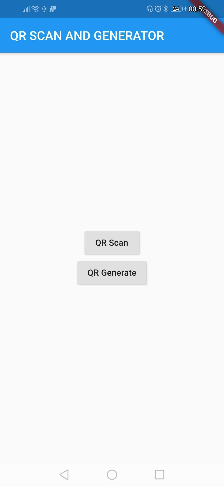
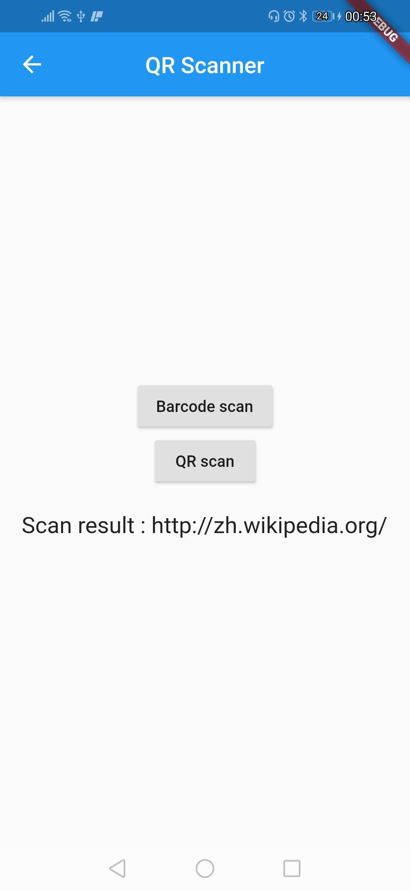
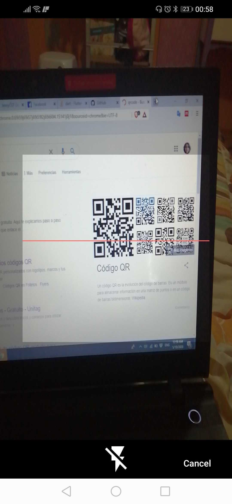
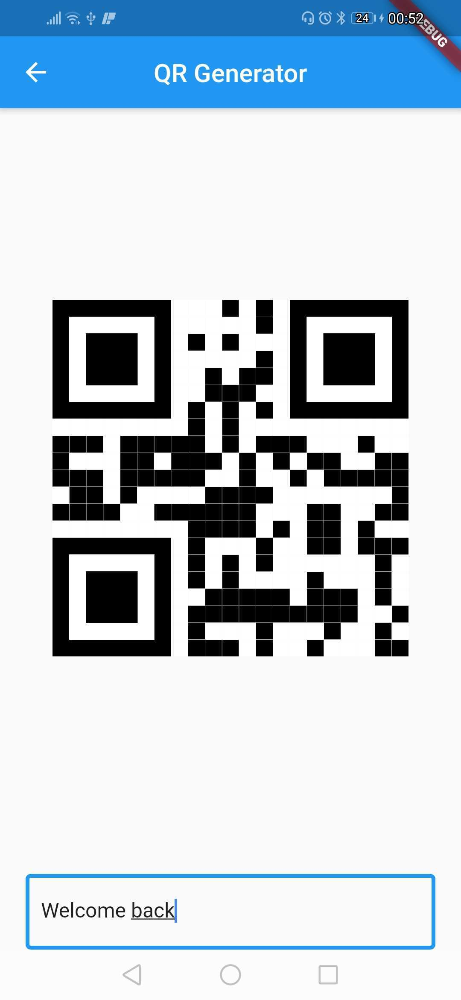

# Scan-and-Generate-QRcode
## Objetive
- Create a screen for a Scan Barcode And QRcode
- Create a screen for generate a QR Code from a input label.
## Software
The program was developed with Flutter ( 1.17.0 )  with thw packages:
- flutter_barcode_scanner: ^1.0.0
- qr_flutter: ^3.1.0

### Principal Screen 
This screen has two button to navigate to the Scan and Generate Screens

### Scan Sceen 
In this screen we have buttons for the options of Barcode Scan and QR code Scan. In the text you could see the information of the code.

### Generate Screen 
This screen show a QRcode wich represent the text "Hello World", in the bottom of the page there is a label input. The Qrcode will be generated with the information placed on the input. The maxime length for Qrcode generator is 85 chacarters.

### ScreenShot

 
 
 
 

 

